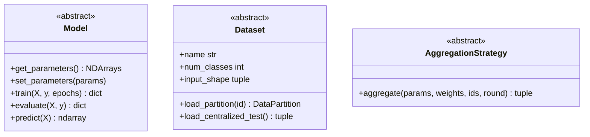
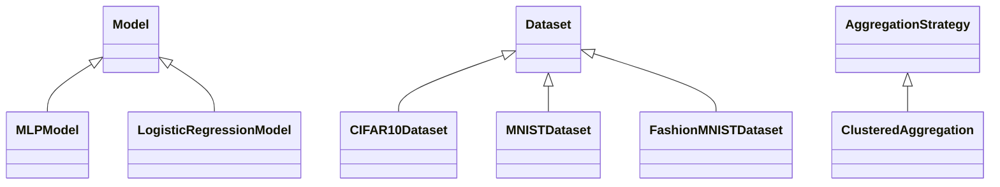
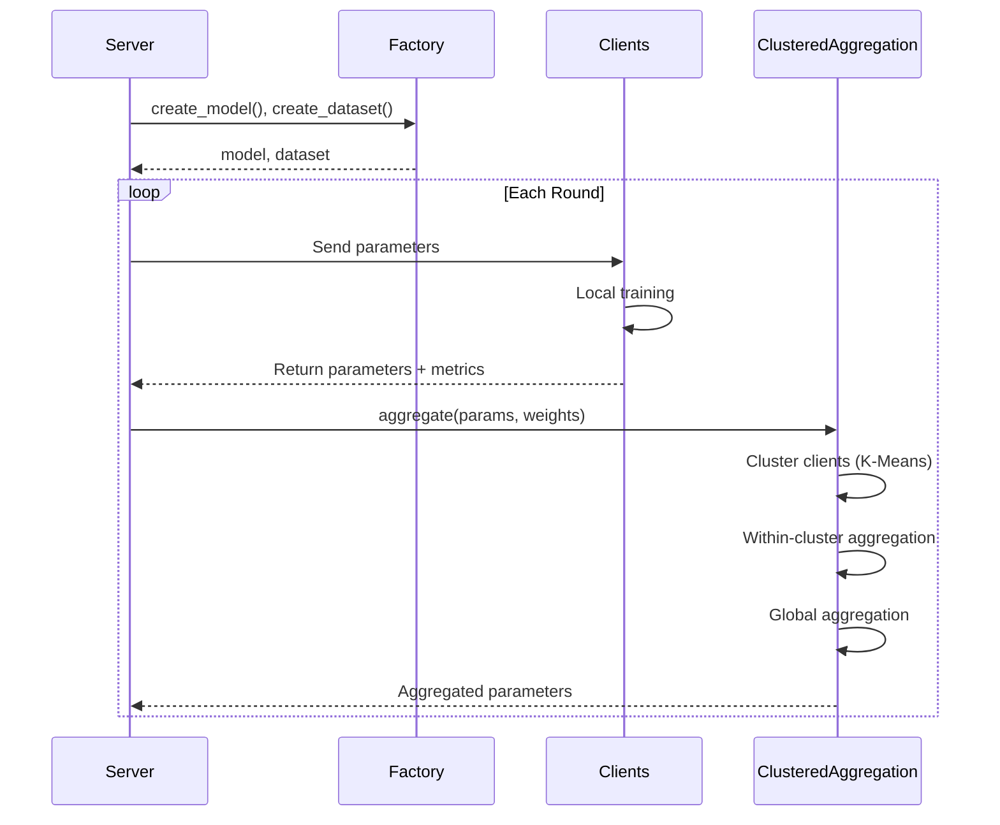

# Architecture

The project follows **Domain-Driven Design (DDD)** principles to achieve clean separation of concerns and easy extensibility.

## Project Structure

```
dynamic_clustering_fl/
├── domain/                     # Core abstractions (interfaces)
│   ├── model.py               # Model ABC
│   ├── dataset.py             # Dataset ABC + DataPartition
│   └── aggregation.py         # Aggregation utilities + strategy ABC
├── infrastructure/             # Concrete implementations
│   ├── models.py              # MLPModel, LogisticRegressionModel
│   ├── datasets.py            # CIFAR10, MNIST, FashionMNIST, CIFAR100
│   └── clustering.py          # ClusteredAggregation strategy
├── factory.py                 # Factory functions for creating models/datasets
├── client_app.py              # Flower ClientApp (agnostic)
└── server_app.py              # Flower ServerApp (agnostic)
```

## Layers

### Domain Layer

The domain layer contains **abstract base classes** that define the contracts for models, datasets, and aggregation strategies.



### Infrastructure Layer

The infrastructure layer provides **concrete implementations** of domain abstractions.



### Application Layer

The application layer contains the **Flower apps** that orchestrate the federated learning process.

- **client_app.py**: Handles local training and evaluation
- **server_app.py**: Manages the FL process with clustering

## Design Principles

### 1. Dependency Inversion

The application layer depends on **abstractions** (domain), not concretions (infrastructure).

```python
# Factory creates the right implementation based on config
model = create_model(model_name, dataset)
dataset = create_dataset(dataset_name, num_partitions)
```

### 2. Open/Closed Principle

The system is **open for extension** (new datasets/models) but **closed for modification** (core FL logic unchanged).

```python
# Adding a new model - just use the decorator
@register_model("my-model")
class MyModel(Model):
    ...
```

### 3. Single Responsibility

Each class has one clear responsibility:

- `Model`: Handle model parameters and training
- `Dataset`: Handle data loading and partitioning
- `ClusteredAggregation`: Handle clustering and aggregation

## Data Flow


