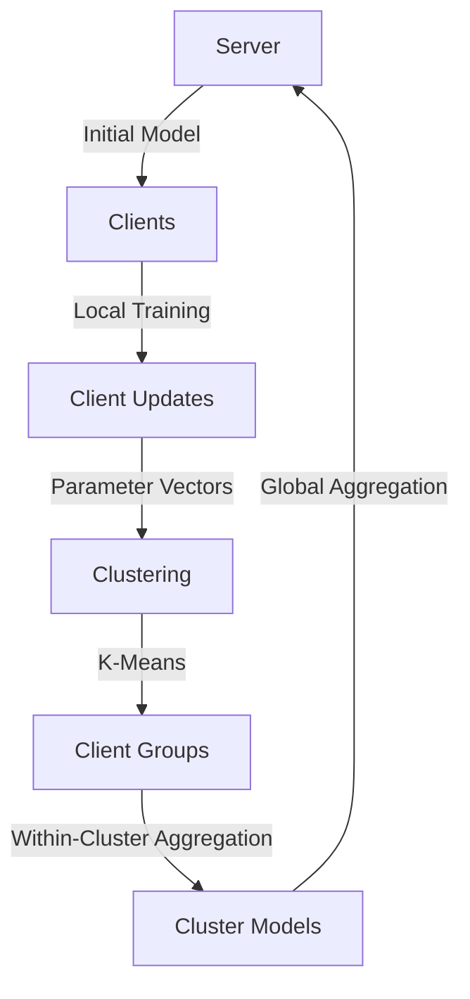

# Dynamic Clustering FL

A **dataset and model-agnostic** implementation of Clustered Federated Learning using [Flower](https://flower.ai/) and Domain-Driven Design (DDD) principles.

## Features

- :material-sync: **Dataset Agnostic** - Support for CIFAR-10, MNIST, Fashion-MNIST, CIFAR-100 (easily extensible)
- :material-brain: **Model Agnostic** - MLP and Logistic Regression included (easily add more)
- :material-chart-scatter-plot: **Dynamic Clustering** - Clients clustered based on model parameter similarity
- :material-layers: **DDD Architecture** - Clean separation of domain, infrastructure, and application layers
- :material-chart-line: **MLflow Integration** - Automatic experiment tracking and model logging
- :material-console: **CLI Configuration** - Override any setting via command line

## Quick Start

```bash
# Install dependencies
pip install -e .

# Run with default settings (CIFAR-10, MLP)
flwr run .

# Run with MNIST dataset
flwr run . --run-config "dataset='mnist'"

# Run with custom configuration
flwr run . --run-config "dataset='fashion-mnist' model='mlp' num-server-rounds=20"
```

## How It Works



1. **Server** sends global model parameters to clients
2. **Clients** train locally on their partitioned data
3. **Clustering** groups clients based on model parameter similarity
4. **Hierarchical Aggregation** first within clusters, then globally
5. **Updated global model** sent back to clients

## Installation

```bash
# Clone the repository
git clone https://github.com/your-username/dynamic_clustering_fl_health_conditions.git
cd dynamic_clustering_fl_health_conditions

# Install in development mode
pip install -e .
```

## Next Steps

- [Configuration](configuration.md) - Learn about all available options
- [Architecture](architecture.md) - Understand the DDD structure
- [Extending](extending.md) - Add custom datasets and models
